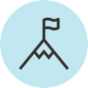

<!-- Improved compatibility of back to top link: See: https://github.com/othneildrew/Best-README-Template/pull/73 -->
<a name="readme-top"></a>
<!--
*** Thanks for checking out the Best-README-Template. If you have a suggestion
*** that would make this better, please fork the repo and create a pull request
*** or simply open an issue with the tag "enhancement".
*** Don't forget to give the project a star!
*** Thanks again! Now go create something AMAZING! :D
-->


<!-- PROJECT SHIELDS -->
<!--
*** I'm using markdown "reference style" links for readability.
*** Reference links are enclosed in brackets [ ] instead of parentheses ( ).
*** See the bottom of this document for the declaration of the reference variables
*** for contributors-url, forks-url, etc. This is an optional, concise syntax you may use.
*** https://www.markdownguide.org/basic-syntax/#reference-style-links
-->

<!-- PROJECT LOGO -->
<div align="center">
  <a href="https://trac-kl33.onrender.com">
    
  </a>
<br />
  <h1 align="center">Trac</h1>

  <p align="center">
    The goal-tracking app that keeps you accountable.
    <br />
    <a href="https://trac-kl33.onrender.com">https://trac-kl33.onrender.com</a>
</div>


<!-- TABLE OF CONTENTS -->
<!-- <details>
  <summary>Table of Contents</summary>
  <ol>
    <li>
      <a href="#about-the-project">About The Project</a>
      <ul>
        <li><a href="#built-with">Built With</a></li>
      </ul>
    </li>
    <li>
      <a href="#getting-started">Getting Started</a>
      <ul>
        <li><a href="#prerequisites">Prerequisites</a></li>
        <li><a href="#installation">Installation</a></li>
      </ul>
    </li>
    <li><a href="#usage">Usage</a></li>
    <li><a href="#roadmap">Roadmap</a></li>
    <li><a href="#contributing">Contributing</a></li>
    <li><a href="#license">License</a></li>
    <li><a href="#contact">Contact</a></li>
    <li><a href="#acknowledgments">Acknowledgments</a></li>
  </ol>
</details> -->


<!-- ABOUT THE PROJECT -->
## About The Project

[![Product Name Screen Shot][product-screenshot]](https://example.com)

 Trac is a web application for tracking goals and staying accountable. It allows you to create Goals and the regular Habits needed to meet them, and then prompts you to send weekly updates on your progress to your friends. 


<p align="right">(<a href="#readme-top">back to top</a>)</p>


### Built With

* [![Typescript][Typescript]][Typescript-url]
* [![React][React.js]][React-url]
* [![Redux][Redux]][Redux-url]
* [![Redux Toolkit][Redux Toolkit]][Redux-Toolkit-url]
* [![Express][Express.js]][Express-url]
* [![Node.js][Nodejs.org]][Node-url]
* [![PostgreSQL][PostgreSQL.org]][PostgreSQL-url]
* [![Prisma][Prisma.io]][Prisma-url]
* [![Chakra UI][Chakra-ui.com]][Chakra-url]
* [![Vite][Vitejs.dev]][Vite-url]
* [Knock](https://knock.app) - An all-in-one app notification system and platform.
* [Nodemailer](https://nodemailer.com) - A module for Node.js applications to allow easy email sending.
* [node.bcrypt.js](https://github.com/kelektiv/node.bcrypt.js#readme) - A bcrypt library for Node.js.
* [node-jsonwebtoken](https://github.com/auth0/node-jsonwebtoken?tab=readme-ov-file#jsonwebtoken) - An implementation of JSON Web Tokens for Node.js.
* [check-password-strength](https://github.com/deanilvincent/check-password-strength#readme) - A password strength checker based from Javascript RegEx.
* [Vite + Express](https://github.com/szymmis/vite-express#readme) - A Vite integration module for Express.js.
* [Render](https://www.render.com) - A cloud application hosting service for developers.


<p align="right">(<a href="#readme-top">back to top</a>)</p>


<!-- GETTING STARTED -->
## Getting Started

This is an example of how you may give instructions on setting up your project locally.
To get a local copy up and running follow these simple example steps.

### Prerequisites

This is an example of how to list things you need to use the software and how to install them.
* npm
  ```sh
  npm install npm@latest -g
  ```

### Installation

_Below is an example of how you can instruct your audience on installing and setting up your app. This template doesn't rely on any external dependencies or services._

1. Get a free API Key at [https://example.com](https://example.com)
2. Clone the repo
   ```sh
   git clone https://github.com/your_username_/Project-Name.git
   ```
3. Install NPM packages
   ```sh
   npm install
   ```
4. Enter your API in `config.js`
   ```js
   const API_KEY = 'ENTER YOUR API';
   ```

<p align="right">(<a href="#readme-top">back to top</a>)</p>


<!-- USAGE EXAMPLES -->
## Usage

Use this space to show useful examples of how a project can be used. Additional screenshots, code examples and demos work well in this space. You may also link to more resources.

_For more examples, please refer to the [Documentation](https://example.com)_

<p align="right">(<a href="#readme-top">back to top</a>)</p>


<!-- ROADMAP -->
## Roadmap

- [x] Add Changelog
- [x] Add back to top links
- [ ] Add Additional Templates w/ Examples
- [ ] Add "components" document to easily copy & paste sections of the readme
- [ ] Multi-language Support
    - [ ] Chinese
    - [ ] Spanish

See the [open issues](https://github.com/othneildrew/Best-README-Template/issues) for a full list of proposed features (and known issues).

<p align="right">(<a href="#readme-top">back to top</a>)</p>


<!-- CONTRIBUTING -->
## Contributing

Contributions are what make the open source community such an amazing place to learn, inspire, and create. Any contributions you make are **greatly appreciated**.

If you have a suggestion that would make this better, please fork the repo and create a pull request. You can also simply open an issue with the tag "enhancement".
Don't forget to give the project a star! Thanks again!

1. Fork the Project
2. Create your Feature Branch (`git checkout -b feature/AmazingFeature`)
3. Commit your Changes (`git commit -m 'Add some AmazingFeature'`)
4. Push to the Branch (`git push origin feature/AmazingFeature`)
5. Open a Pull Request

<p align="right">(<a href="#readme-top">back to top</a>)</p>


<!-- LICENSE -->
## License

Distributed under the MIT License. See `LICENSE.txt` for more information.

<p align="right">(<a href="#readme-top">back to top</a>)</p>


<!-- CONTACT -->
## Contact

Your Name - [@your_twitter](https://twitter.com/your_username) - email@example.com

Project Link: [https://github.com/your_username/repo_name](https://github.com/your_username/repo_name)

<p align="right">(<a href="#readme-top">back to top</a>)</p>


<!-- ACKNOWLEDGMENTS -->
## Acknowledgments

Use this space to list resources you find helpful and would like to give credit to. I've included a few of my favorites to kick things off!

* [Choose an Open Source License](https://choosealicense.com)
* [GitHub Emoji Cheat Sheet](https://www.webpagefx.com/tools/emoji-cheat-sheet)
* [Malven's Flexbox Cheatsheet](https://flexbox.malven.co/)
* [Malven's Grid Cheatsheet](https://grid.malven.co/)
* [Img Shields](https://shields.io)
* [GitHub Pages](https://pages.github.com)
* [Font Awesome](https://fontawesome.com)
* [React Icons](https://react-icons.github.io/react-icons/search)

<p align="right">(<a href="#readme-top">back to top</a>)</p>


<!-- MARKDOWN LINKS & IMAGES -->
<!-- https://www.markdownguide.org/basic-syntax/#reference-style-links -->

[product-screenshot]: images/screenshot.png
[Express.js]: https://img.shields.io/badge/Express.js-grey?style=for-the-badge&logo=express&logoColor=white
[Express-url]: https://expressjs.com
[React.js]: https://img.shields.io/badge/React-20232A?style=for-the-badge&logo=react&logoColor=61DAFB
[React-url]: https://reactjs.org/
[Typescript]: https://img.shields.io/badge/TypeScript-lightgrey?style=for-the-badge&logo=TypeScript&logoColor=blue
[Typescript-url]: https://www.typescriptlang.org
[Redux]: https://img.shields.io/badge/redux-%23593d88.svg?style=for-the-badge&logo=redux&logoColor=whitee
[Redux-url]: https://redux.js.org
[Redux Toolkit]: https://img.shields.io/badge/redux_toolkit-%23593d88.svg?style=for-the-badge&logo=redux&logoColor=white
[Redux-Toolkit-url]: https://redux-toolkit.js.org
[Nodejs.org]: https://img.shields.io/badge/node.js-%23417E38.svg?style=for-the-badge&logo=node.js&logoColor=white
[Node-url]: https://nodejs.org/
[Vitejs.dev]: https://img.shields.io/badge/vite-%23A058FE.svg?style=for-the-badge&logo=vite&logoColor=white
[Vite-url]: https://vitejs.dev
[PostgreSQL.org]: https://img.shields.io/badge/postgres-%23316192.svg?style=for-the-badge&logo=postgresql&logoColor=white
[PostgreSQL-url]: https://www.postgresql.org
[Prisma.io]: https://img.shields.io/badge/prisma-%234C51BF.svg?style=for-the-badge&logo=prisma&logoColor=white
[Prisma-url]: https://www.prisma.io
[Chakra-ui.com]: https://img.shields.io/badge/Chakra_UI-%233FC7BF.svg?style=for-the-badge&logo=chakra-ui&logoColor=white
[Chakra-url]: https://www.chakra-ui.com